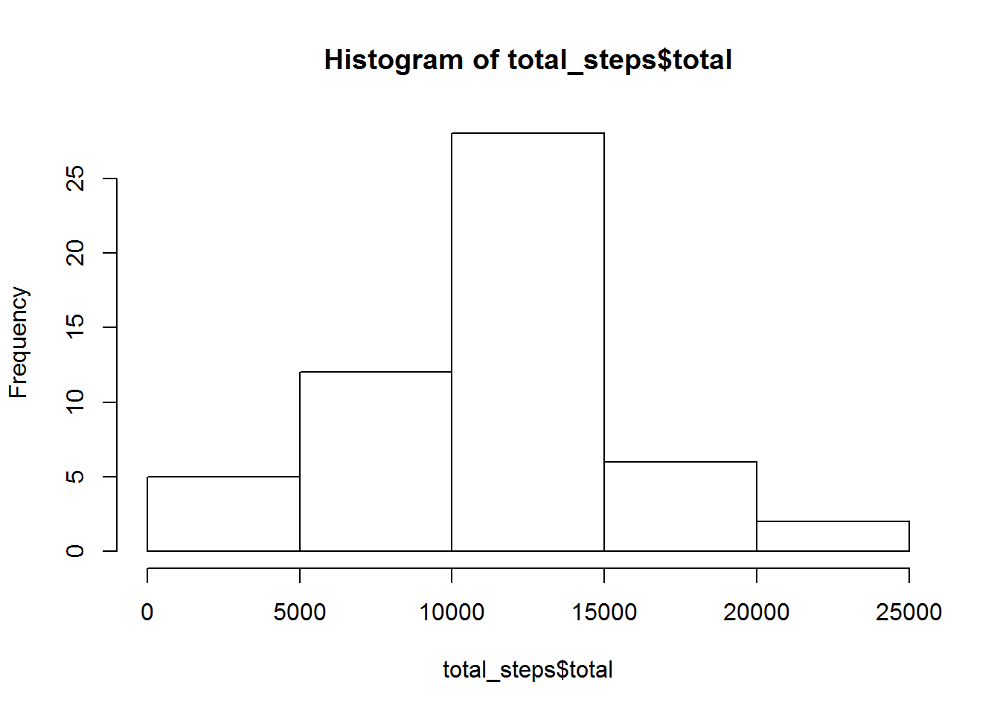
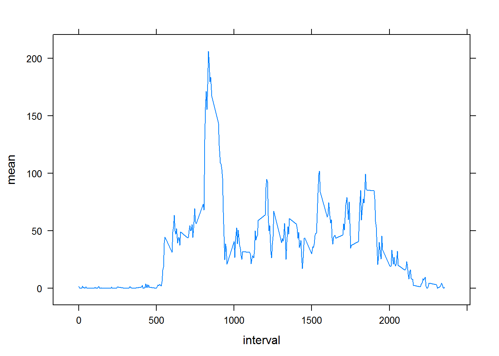
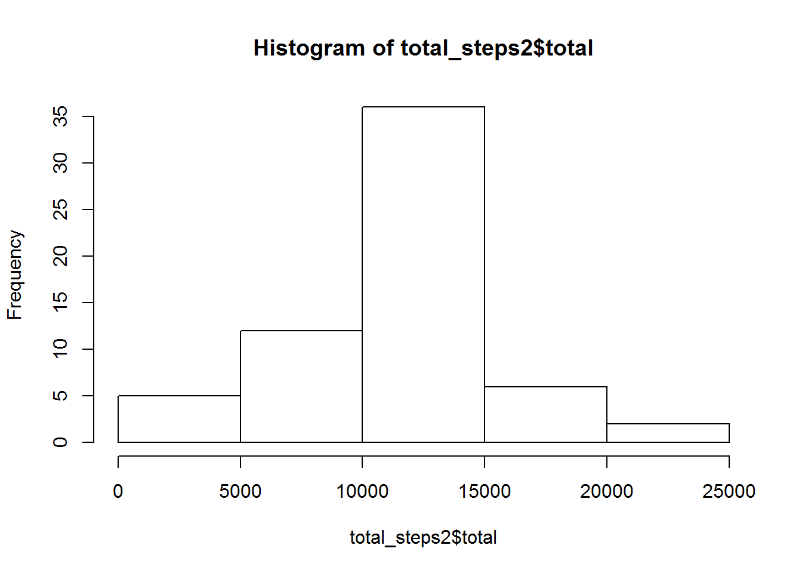
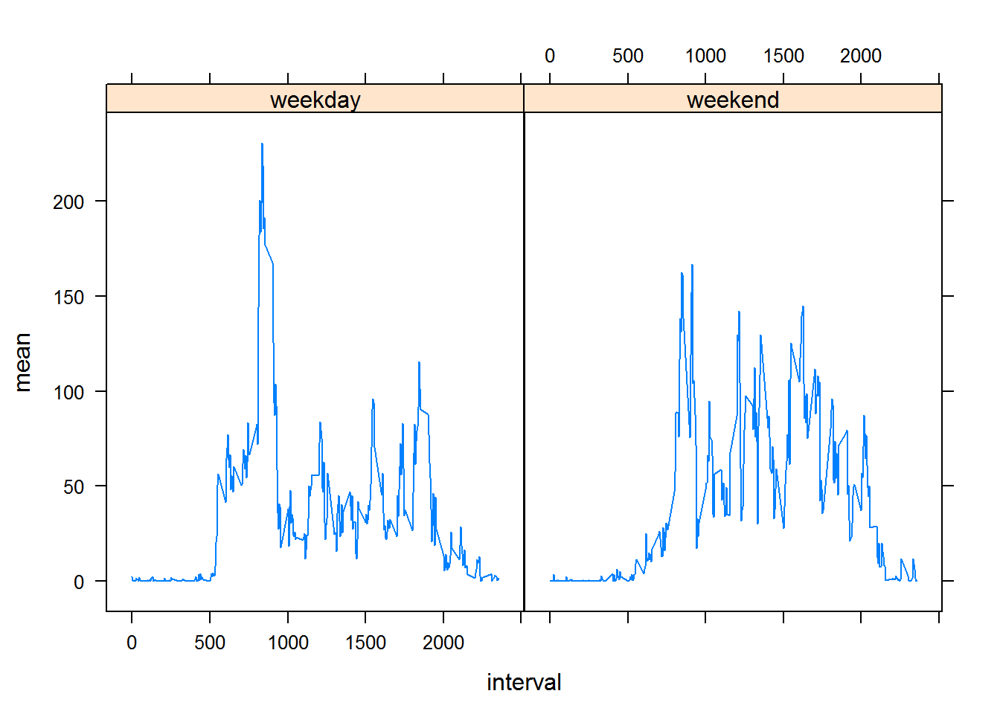

Project 1: Introduction and Loading of Data
-------------------------------------------

The code below read in the csv of the activity data.

    activity <- read.csv("activity.csv")
    class(activity)

    ## [1] "data.frame"

Mean total number of steps taken per day
----------------------------------------

Below is a table of the total of steps per day and a histogram of the
total number of step taken each day.

    library(dplyr)
    total_steps <- activity %>%
      group_by(date) %>%
      summarise(total = sum(steps))

    total_steps

    ## Source: local data frame [61 x 2]
    ## 
    ##          date total
    ##        <fctr> <int>
    ## 1  2012-10-01    NA
    ## 2  2012-10-02   126
    ## 3  2012-10-03 11352
    ## 4  2012-10-04 12116
    ## 5  2012-10-05 13294
    ## 6  2012-10-06 15420
    ## 7  2012-10-07 11015
    ## 8  2012-10-08    NA
    ## 9  2012-10-09 12811
    ## 10 2012-10-10  9900
    ## ..        ...   ...

    hist(total_steps$total)

    mean_steps <- mean(total_steps$total, na.rm = TRUE)

    median_steps <- median(total_steps$total, na.rm = TRUE)

The mean number of steps is 10766, and the median number of steps is
10765

Average daily activity pattern
------------------------------

Below is a time series plot of the average number of steps taken per
interval.

    library(lattice)
    mean_interval <- activity %>%
      group_by(interval) %>%
      summarise(mean = mean(steps, na.rm = TRUE))

    xyplot(mean ~ interval, data = mean_interval, type = "l")

    arrange(mean_interval,desc(mean))

    ## Source: local data frame [288 x 2]
    ## 
    ##    interval     mean
    ##       <int>    <dbl>
    ## 1       835 206.1698
    ## 2       840 195.9245
    ## 3       850 183.3962
    ## 4       845 179.5660
    ## 5       830 177.3019
    ## 6       820 171.1509
    ## 7       855 167.0189
    ## 8       815 157.5283
    ## 9       825 155.3962
    ## 10      900 143.4528
    ## ..      ...      ...

The 5-minute interval with the highest average steps is 835.

Imputing missing values
-----------------------

The code below substitutes the average number of steps per interval for
missing values (e.g., NA).

    sum(is.na(activity$steps))

    ## [1] 2304

    activity2 <- left_join(activity,mean_interval,by="interval")
    activity2[is.na(activity2$steps),]$steps <- activity2[is.na(activity2$steps),]$mean

    total_steps2 <- activity2 %>%
      group_by(date) %>%
      summarise(total = sum(steps))

    hist(total_steps2$total)

    mean_steps2 <- mean(total_steps2$total)

    median_steps2 <- median(total_steps2$total)

For the dataset with the imputed values (e.g., activity2), the mean
number of steps is 10766, and the median number of steps is 10766

Activity patterns for weekday and weekends
------------------------------------------

    activity2$day <- weekdays(as.Date(activity2$date))

    weekend <- function(day) {if (day %in% c('Saturday','Sunday')) 
      {
            "weekend"
      } else {
            "weekday"
      }
    }

    activity2$weekend <- sapply(activity2$day, weekend)
    activity2$weekend <- as.factor(activity2$weekend)

    mean_interval2 <- activity2 %>%
      group_by(interval, weekend) %>%
      summarise(mean = mean(steps))

    xyplot(mean ~ interval | weekend, data= mean_interval2, type = "l")

There is a difference in the pattern for weekends and weekdays.
